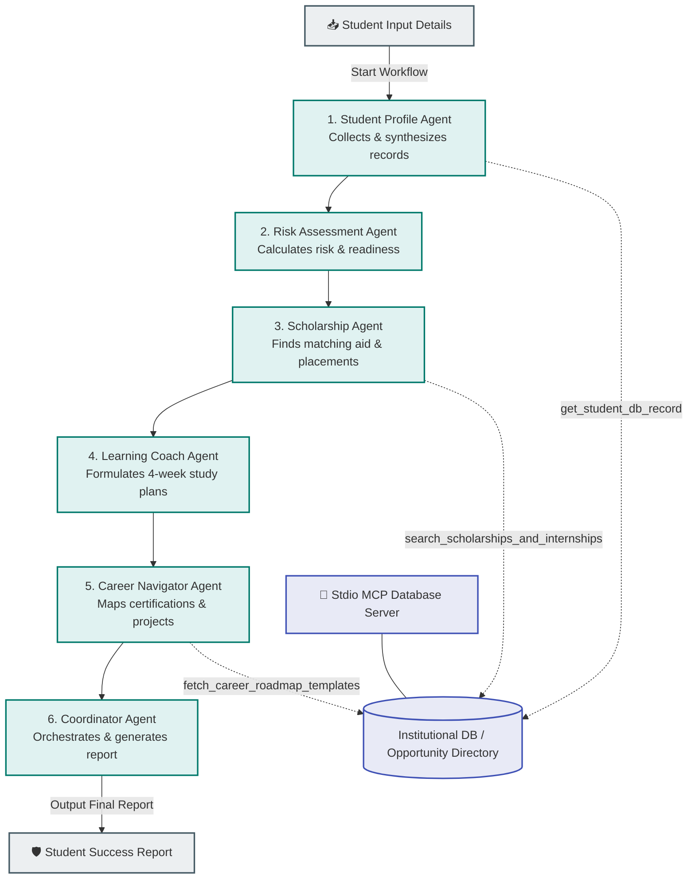

# 🛡️ EduShield AI: Autonomous Student Success & Dropout Prevention Platform

EduShield AI is a state-of-the-art, production-ready **multi-agent AI platform** designed to identify students at risk of academic failure, skill gaps, financial challenges, and career uncertainty. By combining **Google Agent Development Kit (ADK)** agents with **Model Context Protocol (MCP)** tool connections, the platform generates comprehensive, explainable academic insights and actionable 30-day intervention plans.

---

## 📐 Multi-Agent Architecture

EduShield AI operates as a sequential graph of six specialized agents communicating in a single conversation context. They resolve raw metrics, perform database lookups through an MCP Server, analyze risks, find scholarships, establish study roadmaps, and synthesize final success reports.



### 1. The Six Specialized Agents
1. **Student Profile Agent:** Collects parameters (CGPA, attendance, department) and pulls institutional records via MCP to compile a unified Markdown student profile.
2. **Risk Assessment Agent:** Calculates the *Academic Risk Score* and *Placement Readiness Score*, detects key skill gaps, and issues early warning risk indicators.
3. **Scholarship & Opportunity Agent:** Matches the student against external scholarship criteria, discovers internships, and targets hackathons.
4. **Learning Coach Agent:** Formulates a tailored 30-day weekly learning schedule with daily milestones and recommended open-source resources.
5. **Career Navigator Agent:** Suggests high-value career paths, portfolio projects to add to the resume, and interview prep guides.
6. **Intervention Coordinator Agent:** Synthesizes the overall *Student Success Score* and generates the final structured student success report containing immediate actions.

---

## 🔌 Model Context Protocol (MCP) Integration

The platform includes an **MCP Database Server** built on the `FastMCP` standard (`mcp_server.py`). The server exposes secure tools that query private database records and registry APIs:
- `get_student_db_record`: Retrieves GPA history, warning indicators, and active financial aid status.
- `search_scholarships_and_internships`: Performs multi-parameter matching over scholarships, internships, and certifications.
- `fetch_career_roadmap_templates`: Fetches standard career roadmap phases and recommended projects.

The ADK agents connect to the MCP server securely using the standard `stdio_client` transport.

---

## 🚀 Quick Start Guide

### 1. Prerequisites
- Python 3.10+ (tested on Python 3.13.2)
- Graphviz executables (optional, for diagram generation)

### 2. Installation
Clone the project directory, navigate into it, and install dependencies:
```bash
pip install -r requirements.txt
```

### 3. Running the Dashboard
Start the Streamlit dashboard:
```bash
streamlit run app.py
```

---

## ⏱️ 5-Minute Demo Scenario

We have preloaded a sample student scenario to test the platform out-of-the-box without requiring an API key:

### Student: Lohitha
- **Department:** CSE
- **CGPA:** 8.9 / 10.0
- **Attendance:** 82% (Caution zone)
- **Skills:** Python, Power BI, Machine Learning
- **Career Goal:** AI Engineer

### Step-by-Step Demo Guide:
1. Select the **Lohitha** preset from the sidebar.
2. Click **Analyze Student Risks**.
3. View the live execution simulation trace in the console tabs.
4. Navigate through the dynamic dashboard tabs:
   - **Student Overview:** Unified student profile and GPA trends.
   - **Academic Insights:** Interactive warning gauge for class attendance.
   - **Scholarships & Opportunities:** Matching awards (Google Generation and Adobe Research scholarships) and open placements (NVIDIA Deep Learning Intern).
   - **Career Guidance & Skills:** Skill gaps chart (missing Git, MLOps, Deep Learning) and certification path.
   - **Intervention Action Plan:** 30-day coordinated plan with checkboxes.
5. Optionally, input your `GEMINI_API_KEY` in the sidebar and select **Live ADK Mode** to run the live Google ADK reasoning chain using `gemini-2.5-flash`.

---

## 🧪 Testing
Run the automated test suite to verify tool lookups, agent structure, and simulation steps:
```bash
pytest tests/test_system.py
```
